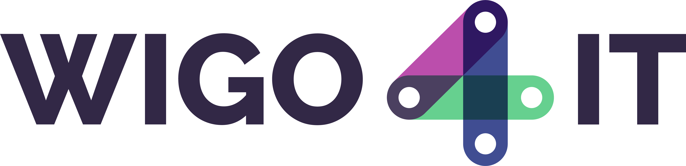
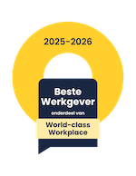

## Public money = public code
Wigo4it is a public cooperative of the four largest municipalities (Amsterdam, Rotterdam, The Hague and Utrecht) in the Netherlands. We build and run public software that is used and relied on every day, including social welfare benefits (bijstand) for more than 110.000 citizens. 

As a public organization, we support public money = public code. In our view, open source is key to digital independence, transparency and long-term ownership in government. 
 
## What you’ll find here 
Wigo4it's GitHub page serves as a starting point for contributing more of our work and knowledge to the open-source community. Over time we’ll add more code, frameworks and tools that we develop and work with every day. While we work on that you’ll find here: insight into how we make technical choices (tech radar), vb, vb.  

<!-- ## Technologies we work with  
Icons  -->

## Giving back 
We actively share what we learn about technology, culture and digital independence. This GitHub focuses on code and technical practice. For broader context, publications and reflections, please refer to the [publications](https://www.wigo4it.nl/publicaties/downloads/ ) on our website. 

Some recent examples include:
- [Bring it on! How Wigo4it stays independent and agnostic in the Azure cloud (Techorama 2025)](https://www.wigo4it.nl/nieuws/race-naar-digital-independence-wigo4it-bij-techorama/)
- Podcast: Herprogrammeer de Overheid ([Spotify](https://lnkd.in/exsk3Kfi) or [Apple podcast](https://lnkd.in/ePjJC_dG))
- [Sustainable IT Impact Assessment (SIIA)](https://coalitieduurzamedigitalisering.nl/sustainable-it-impact-assessment-siia/)
 
## We build it. We run it. People depend on it. 
As a non-commercial public organization we run software that directly affects people’s life. Interested in building public software with daily social impact? See our open roles. 

